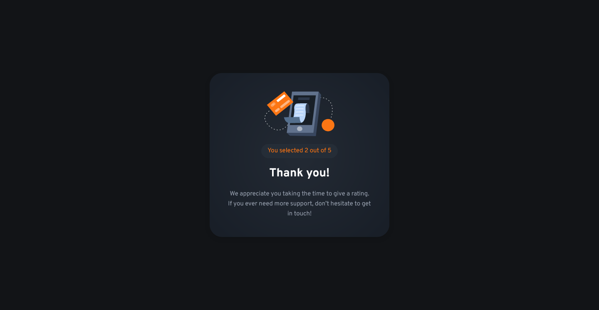

# Frontend Mentor - Interactive rating component solution

This is a solution to the [Interactive rating component challenge on Frontend Mentor](https://www.frontendmentor.io/challenges/interactive-rating-component-koxpeBUmI). Frontend Mentor challenges help you improve your coding skills by building realistic projects.

## Table of contents

- [Overview](#overview)
  - [The challenge](#the-challenge)
  - [Screenshot](#screenshot)
  - [Links](#links)
- [My process](#my-process)
  - [Built with](#built-with)
  - [What I learned](#what-i-learned)
  - [Continued development](#continued-development)
  - [Useful resources](#useful-resources)
- [Author](#author)
- [Acknowledgments](#acknowledgments)

## Overview

### The challenge

Users should be able to:

- View the optimal layout for the app depending on their device's screen size
- See hover states for all interactive elements on the page
- Select and submit a number rating
- See the "Thank you" card state after submitting a rating

### Screenshot

Screenshot of the Desktop Version:

Screenshot of the Mobile Version:

### Links

- Github Repo: [Repo](https://github.com/Clytax/rateme)
- Live Site URL: [Rateme](https://rateme.vercel.app/)

## My process

### Built with

- [React](https://reactjs.org/) - JS library
- [Next.js](https://nextjs.org/) - React framework
- [BEM Naming convention](http://getbem.com/naming/)
- SCSS/SASS
- Flexbox
- CSS Grid
- Mobile-first workflow

### What I learned

I never really managed to create mobile responsive layouts, for some reason I always had problems with it. But here I managed to do enough research to succeed! I'm pretty excited about how it turned out 😊

### Continued development

I really wanna keep using React and try to keep doing the "Mobile first" workflow.

### Useful resources

- [Kevin Powell](https://www.youtube.com/kevinpowell) - This man is a legend. He provides us with so much great content for free! He taught me most of the things I now know about Responsive Web Design!

## Author

- Website - [Marco Spano](~Under Development~)
- Frontend Mentor - [@Clytax](https://www.frontendmentor.io/profile/Clytax)
- Twitter - [@EinfachCoden](https://twitter.com/EinfachCoden)

## Acknowledgments

Even though I worked alone on this project, I want to say how thankful I am for the front-end mentor! It's really amazing how much I learned by doing it. Youtube tutorials can only take you so far, but you have to do these things yourself to learn!
